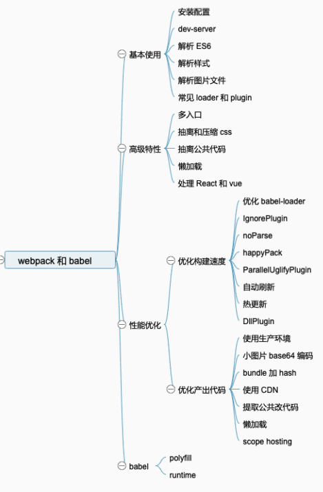
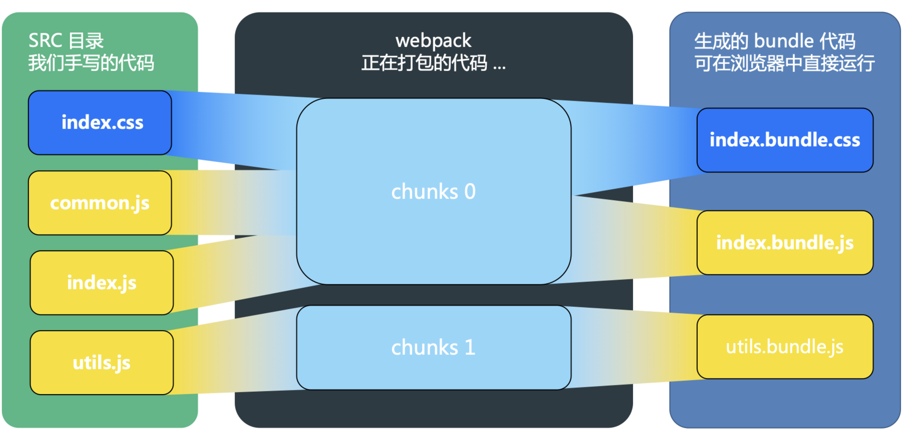

# webpack 配置总结

#### why webpack?
  当我们遇到一个新技术时，第一步应该考虑的就是这个技术解决了什么问题，带来了什么优势  
  https://webpack.docschina.org/concepts/why-webpack/



电子书： [《深入浅出webpack》](http://webpack.wuhaolin.cn/)

#### 配置文件拆分
- `webpack.common.js`: 公共配置抽离-如entry, 各种loader, HtmlWebpackPlugin  
- `webpack.dev.js`: 开发环境独有配置-如 webpack-dev-server  
- `webpack.prod.js`: 生产环境独有配置-如文件指纹, scope hoisting, css抽离, 代码压缩, splitChunks等  

在dev,prod中使用 webpack-merge 将common配置合并

#### 基本概念
- entry: 入口  
- output: 输出  
- [loader](https://webpack.docschina.org/loaders/): 模块转换器，用于把模块原内容按照需求转换成新内容  
- [plugins](https://webpack.docschina.org/plugins/): 扩展插件，在webpack构建流程中的特定时机注入扩展逻辑来改变构建结果或做你想要做的事情
- module: 我们写的每一个文件都是module
- chunk: 多个module的组合为chunk
- bundle: webpack打包成的最终结果为bundle  
> loader执行顺序：从右往左, 因为compose实现

  

#### 多入口配置
<details><summary>展开</summary>

``` js
// webpack.common.js
const path = require('path')
const HtmlWebpackPlugin = require('html-webpack-plugin')
const { srcPath, distPath } = require('./paths')

module.exports = {
  entry: {
    index: path.join(srcPath, 'index.js'),
    other: path.join(srcPath, 'other.js')
  },
  module: {
    ...
  },
  plugins: [
    // 多入口 - 生成 index.html
    new HtmlWebpackPlugin({
      template: path.join(srcPath, 'index.html'),
      filename: 'index.html',
      // chunks 表示该页面要引用哪些 chunk （即上面的 index 和 other），默认全部引用
      chunks: ['index']  // 只引用 index.js
    }),
    // 多入口 - 生成 other.html
    new HtmlWebpackPlugin({
      template: path.join(srcPath, 'other.html'),
      filename: 'other.html',
      chunks: ['other']  // 只引用 other.js
    })
  ]
}

```
</details> 

#### 处理css
##### 1. loader解析 & autoprefixer
``` js
//webpack.common.js
module.exports = {
  ...
  module: {
    rules: [
      {
        test: /\.(le|c)ss$/,
        use: [
          'style-loader', // 将样式文件以 <style></style> 形式插入html
          'css-loader',  // 解析css文件
          {
            loader: 'postcss-loader',
            options: {
              plugins: function () {
                return [
                  require('autoprefixer')({ // 自动添加前缀
                    "overrideBrowserslist": [ ">0.25%", "not dead" ]
                  })
                ]
              }
            }
          }, 
          'less-loader'], // less => css, sass 配置相似 改为sass-loader
        exclude: /node_modules/
      }
    ]
  }
}

```
##### 2. css 抽离 & 压缩 (prod使用)
``` js
// webpack.prod.js
const MiniCssExtractPlugin = require('mini-css-extract-plugin')
const TerserJSPlugin = require('terser-webpack-plugin')
const OptimizeCSSAssetsPlugin = require('optimize-css-assets-webpack-plugin')
module.exports = {
  //...
  css rule中, MiniCssExtractPlugin.loader 替换对应 style-loader
  //...
  plugins: [
    // 抽离 css 文件
    new MiniCssExtractPlugin({
      filename: 'css/main.[contenthash:8].css'
    })
  ],
  optimization: {
    // 压缩 css
    minimizer: [
      new TerserJSPlugin({}), // 压缩js https://blog.csdn.net/LLL_liuhui/article/details/103887900
      new OptimizeCSSAssetsPlugin({}) // 压缩css
    ]
  }
}
```

?> 将css文件单独提取出来，那么就可以先在页面的最前面引入这个单独的css文件，浏览器先解析了css文件就会生成cssom从而与dom tree生成渲染树从而以最快速度渲染出页面。如果放在js文件中，不仅会增加js文件体积，使js文件的下载时间延长，而且进行解析js文件往往都是在dom树生成之后，那么这两者增加的延迟会大大影响渲染速度，削弱用户体验。

#### webpack 优化方案

##### 优化打包构建速度
###### 1.babel-loader优化
```
// webpack.common.js
{
  test: /\.js$/,
  loader: ['babel-loader?cacheDirectory'],
  include: srcPath
}
```
###### 2.happypack多进程打包 (prod)
``` js
// webpack.prod.js
const HappyPack = require('happypack')
module.exports = {
  ...
  module: {
    rules: [
      // js
      {
        test: /\.js$/,
        // 把对 .js 文件的处理转交给 id 为 babel 的 HappyPack 实例
        use: ['happypack/loader?id=babel'],
        include: srcPath
      }
      ...
    ]
  }
  ...
  plugins: [
    // happyPack 开启多进程打包
    new HappyPack({
      // 用唯一的标识符 id 来代表当前的 HappyPack 是用来处理一类特定的文件
      id: 'babel',
      // 如何处理 .js 文件，用法和 Loader 配置中一样
      loaders: ['babel-loader?cacheDirectory']
    })
  ]
}
```
!> 多进程打包 ≠ 一定快, 多进程有开销, 建议在项目很大构建速度缓慢时再尝试使用
###### 3.Parallel多进程压缩 (prod)
官方推荐使用 [TerserPlugin](https://webpack.docschina.org/plugins/terser-webpack-plugin/)
```js
module.exports = {
  optimization: {
    minimize: true,
    minimizer: [
      new TerserPlugin({
        parallel: true,
      }),
    ],
  },
}
```

##### 优化产出代码
###### 1.小图片base64内联(prod)
``` js
rules: [
  // 图片 - 考虑 base64 编码的情况
  {
    test: /\.(png|jpg|jpeg|gif)$/,
    use: {
      loader: 'url-loader',
      options: {
        // 小于 5kb 的图片用 base64 格式产出
        // 否则，依然延用 file-loader 的形式，产出 url 格式
        limit: 5 * 1024,
        // 打包到 img 目录下
        outputPath: '/img1/',
        name: '[name]_[hash:6].[ext]'
        // 设置图片的 cdn 地址（也可以统一在外面的 output 中设置，那将作用于所有静态资源）
        // publicPath: 'http://cdn.abc.com'
      }
    }
  },
]
```
?> 将资源转换为 base64 可以减少网络请求次数，但是 base64 数据较大，如果太多的资源是 base64，会导致加载变慢，因此设置 limit 值时，需要二者兼顾

###### 2.文件指纹策略(prod)
关于hash值：https://jkfhto.github.io/2019-10-18/webpack/webpack-%E6%96%87%E4%BB%B6%E6%8C%87%E7%BA%B9%E7%AD%96%E7%95%A5%EF%BC%9Achunkhash%E3%80%81contenthash%E5%92%8Chash/
- hash: 和整个项⽬的构建相关，只要项⽬⽂件有修改，整个项⽬构建的 hash 值就会更改
- chunkhash: 和 webpack 打包的 chunk 有关，根据不同的 chunk 及其包含的模块计算出来的 hash，chunk 中包含的任意模块发生变化，则 chunkhash 发生变化
- contenthash: 根据文件内容来定义 hash ，`自身`⽂件内容不变，则 contenthash 不变  
`js => chunkhash css => contenthash img & font => hash`  

!> webpack 5下均采用小写而不是camelcase

###### 3.大文件懒加载
用法： https://webpack.docschina.org/api/module-methods/#import 
``` js
vue-router 为例
{
  path: 'index',
  component: () => import('views/xxx/index.vue'),
  name: `${routeName}Index`,
  meta: { title: 'xxxx' }
}
```

Webpack 支持异步加载模块的特性，从原理上说其实很简单——就是动态地向页面中插入 script 标签。比如一个拥有五个页面（或者说路由状态）的单页应用，我们在首页加载的 index.js 中只放首页需要的逻辑。而另外四个页面的逻辑则通过跳转到其对应路由状态时再进行异步加载。这样的话就实现了只加载用户需要的模块，也就是按需加载。
在代码层面，Webpack 支持两种方式进行异步模块加载，一种是 CommonJS 形式的require.ensure，一种是 ES6 Module 形式的异步import()

?>[动态import & treeShaking](https://github.com/webpack/webpack.js.org/issues/2684)

###### 4.splitChunks提取公共代码(prod)
``` js
optimization: {
  ...
  // 分割代码块
  splitChunks: {
    chunks: 'all',
    /**
      * initial 入口chunk，对于异步导入的文件不处理
        async 异步chunk，只对异步导入的文件处理
        all 全部chunk
      */
    // 缓存分组
    cacheGroups: {
      // 第三方模块
      vendor: {
        name: 'vendor', // chunk 名称
        priority: 1, // 权限更高，优先抽离，重要！！！
        test: /node_modules/,
        minSize: 30000,  // 大小限制 默认值30000
        minChunks: 1  // 最少复用过几次
      },

      // 公共的模块
      common: {
        name: 'common', // chunk 名称
        priority: 0, // 优先级
        minSize: 30000,  // 公共模块的大小限制 默认值30000
        minChunks: 2  // 公共模块最少复用过几次
      }
    }
  }
}
```

###### 5.cdn加速(prod)
静态资源上传cdn后, 配置publicPath
dll打包出的文件也可放入  

###### 6.使用production mode
`dev`下应该使用mode development  
- 自动进行代码压缩  
- 自动删除 vue react等调试代码(warning等)  
- 开启 [tree shaking](https://webpack.docschina.org/guides/tree-shaking/#root)  
- [scope hoisting](https://webpack.docschina.org/plugins/module-concatenation-plugin/#root)  
- 其他可看[官网示例](https://webpack.docschina.org/configuration/mode/)  

###### 7.scope hoisting(prod)
?> 此配置 mode = production 时会默认开启
[如何手动开启](http://webpack.wuhaolin.cn/4%E4%BC%98%E5%8C%96/4-14%E5%BC%80%E5%90%AFScopeHoisting.html)  

使用scope hoisting会减少打包产生的函数数量,提交变小,作用域变少内存开销也随之变小,打包出的bundle可读性变强  
```js
// 源代码
// main.js
export default "hello world~";
// index.js
import str from "./main.js";
console.log(str);

// 未开启scope hoisting
[  
(function (module, __webpack_exports__, __webpack_require__) {    var __WEBPACK_IMPORTED_MODULE_0__main_js__ = __webpack_require__(1);    console.log(__WEBPACK_IMPORTED_MODULE_0__main_js__["a"]);  }),  
(function (module, __webpack_exports__, __webpack_require__) {    __webpack_exports__["a"] = ('hello world~');  })
]

// 开启
[  (function (module, __webpack_exports__, __webpack_require__) {    var main = ('hello world~');    console.log(main);  })]
```
Scope Hoisting 的实现原理其实很简单:分析出模块之间的依赖关系,尽可能将打散的模块合并到一个函数中,前提是不能造成代码冗余, 因此`只有那些被引用了一次的模块才能被合并`
由于 Scope Hoisting 需要分析出模块之间的依赖关系,因此源码`必须采用 ES6 模块化语句`,不然它将无法生效


